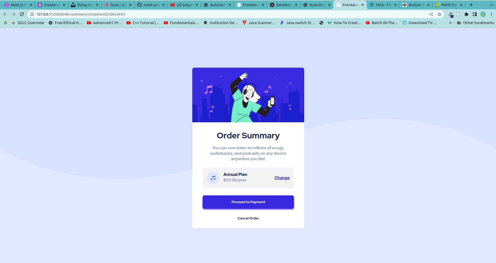
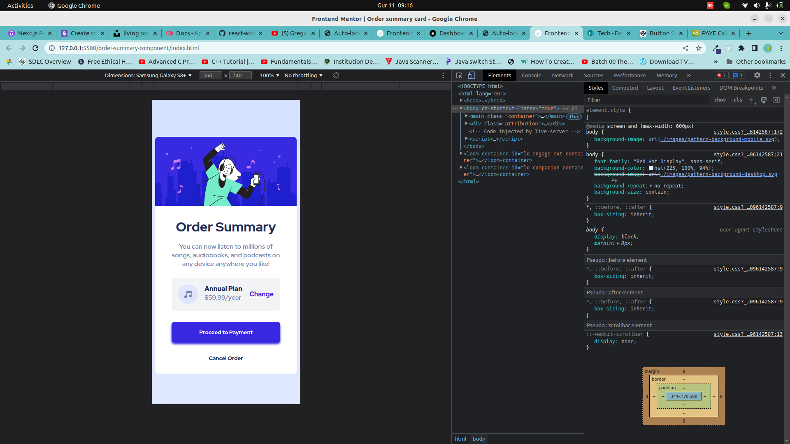

# Frontend Mentor - Order summary card solution

This is a solution to the [Order summary card challenge on Frontend Mentor](https://www.frontendmentor.io/challenges/order-summary-component-QlPmajDUj). Frontend Mentor challenges help you improve your coding skills by building realistic projects.

## Table of contents

- [Overview](#overview)
  - [The challenge](#the-challenge)
  - [Screenshot](#screenshot)
  - [Links](#links)
- [My process](#my-process)
  - [Built with](#built-with)
  - [What I learned](#what-i-learned)
- [Author](#author)

## Overview

### The challenge

Users should be able to:

- View the optimal layout depending on their device's screen size
- See hover and focus states for interactive elements

### Screenshot

### Links

- Solution URL: [github link](https://github.com/Amakoye/order-summary-component)
- Live Site URL: [demo link](https://product-preview-card-component-mauve-iota.vercel.app/)

## My process

### Built with

- Semantic HTML5 markup
- CSS custom properties
- Flexbox

### What I learned

I used most of the concepts I used while doing the product preview card component. I didn't struggle much coz the layout is quite simple, and does not change on small devices. I utilized the flex box to layout the page as designed.

### Continued development

I did struggle with making the shadow effect on the button. I did not bring it out as close to the one in design. I'll be looking forward to refining that to be as close to perfect as possible. Comments on how I can achieve this are welcomed and shall be highly appreciated. Thanks.

## Author

- Website - [Amakoye Charles](https://github.com/Amakoye)
- Frontend Mentor - [@Amakoye](https://www.frontendmentor.io/profile/Amakoye)
- Twitter - [@charlesamakoye](https://www.twitter.com/charlesamakoye)
